# InternLM2-Tutorial-Assignment-Lecture7      
# OpenCompass 司南 大模型评测实战    
2024.4.19   OpenCompass 贡献者曹茂松、刘卓鑫    

[第7课 视频](https://www.bilibili.com/video/BV1Pm41127jU/)    
[第7课 文档](https://github.com/InternLM/Tutorial/blob/camp2/opencompass/readme.md)      
[第7课 作业](https://github.com/InternLM/Tutorial/blob/camp2/opencompass/homework.md)       

# 第7课 笔记  

# 理论    

## 为什么要研究大模型的评测？    

- 研究评测对于我们全面了解大型语言模型的优势和限制至关重要。
- 研究评测有助于指导和改进人类与大型语言模型之间的协同交互，更好地设计人机交互的新范式。
- 研究评测可以帮助我们更好地规划大型语言模型未来的发展，并预防未知和潜在的风险， 能够从进化的角度评估模型的能力，并提前预测潜在的风险。
- 了解不同语言模型之间的性能、舒适性和安全性，能够帮助人们更好地选择适合的模型，这对于研究人员和产品开发者而言同样具有重要意义。

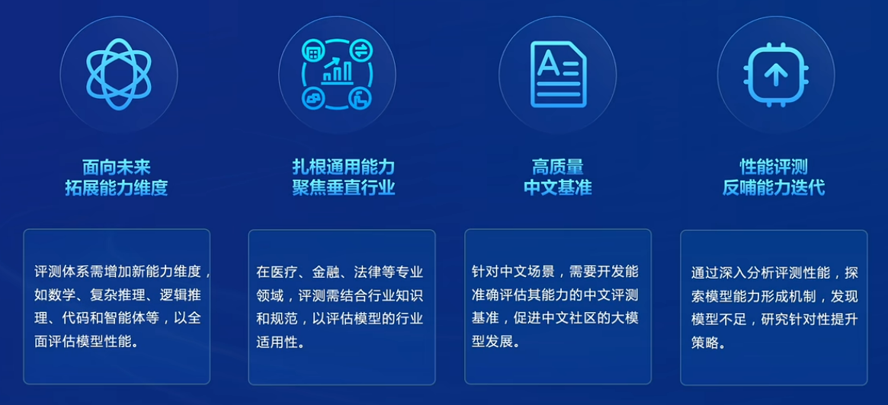   
  
## OpenCompass介绍    

上海人工智能实验室科学家团队正式发布了大模型开源开放评测体系 “司南” (OpenCompass2.0)，用于为大语言模型、多模态模型等提供一站式评测服务。其主要特点如下：    
  - 开源可复现：提供公平、公开、可复现的大模型评测方案
  - 全面的能力维度
  - 丰富的模型支持：已支持 20+ HuggingFace 及 API 模型
  - 分布式高效评测：一行命令实现任务分割和分布式评测，数小时即可完成千亿模型全量评测
  - 多样化评测范式：支持零样本、小样本及思维链评测，结合标准型或对话型提示词模板，轻松激发各种模型最大性能
  - 灵活化拓展：想增加新模型或数据集？想要自定义更高级的任务分割策略，甚至接入新的集群管理系统？OpenCompass 的一切均可轻松扩展！

opencompass是Meta官方指定的唯一国产大模型测评工具。

## 评测对象    

本算法库的主要评测对象为语言大模型与多模态大模型。我们以语言大模型为例介绍评测的具体模型类型。    
  - 基座模型：一般是经过海量的文本数据以自监督学习的方式进行训练获得的模型（如OpenAI的GPT-3，Meta的LLaMA），往往具有强大的文字续写能力。
  - 对话模型：一般是在的基座模型的基础上，经过指令微调或人类偏好对齐获得的模型（如OpenAI的ChatGPT、上海人工智能实验室的书生·浦语），能理解人类指令，具有较强的对话能力。

## 工具架构    

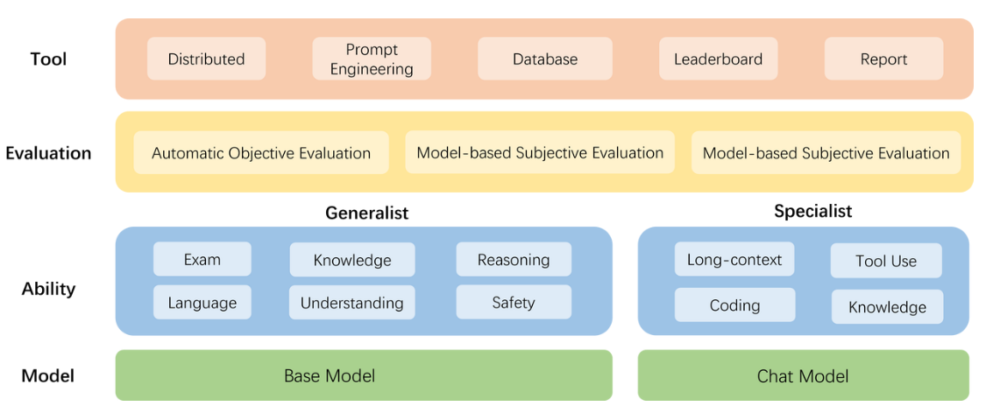    

- 模型层：大模型评测所涉及的主要模型种类，OpenCompass以基座模型和对话模型作为重点评测对象。
- 能力层：OpenCompass从本方案从通用能力和特色能力两个方面来进行评测维度设计。在模型通用能力方面，从语言、知识、理解、推理、安全等多个能力维度进行评测。在特色能力方面，从长文本、代码、工具、知识增强等维度进行评测。
- 方法层：OpenCompass采用客观评测与主观评测两种评测方式。客观评测能便捷地评估模型在具有确定答案（如选择，填空，封闭式问答等）的任务上的能力，主观评测能评估用户对模型回复的真实满意度，OpenCompass采用基于模型辅助的主观评测和基于人类反馈的主观评测两种方式。
- 工具层：OpenCompass提供丰富的功能支持自动化地开展大语言模型的高效评测。包括分布式评测技术，提示词工程，对接评测数据库，评测榜单发布，评测报告生成等诸多功能。
  
OpenCompass 司南 的开源发展历程如下：    

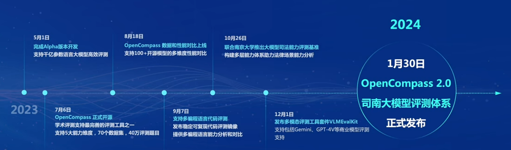  

## 设计思路    

为准确、全面、系统化地评估大语言模型的能力，OpenCompass从通用人工智能的角度出发，结合学术界的前沿进展和工业界的最佳实践，提出一套面向实际应用的模型能力评价体系。OpenCompass能力维度体系涵盖通用能力和特色能力两大部分。   

## 测试方法    

OpenCompass采取客观评测与主观评测相结合的方法。   
针对具有确定性答案的能力维度和场景，通过构造丰富完善的评测集，对模型能力进行综合评价。    
针对体现模型能力的开放式或半开放式的问题、模型安全问题等，采用主客观相结合的评测方式。

## 客观测评与主观测评    

- 客观测评：针对具有标准答案的客观问题，我们可以我们可以通过使用定量指标比较模型的输出与标准答案的差异，并根据结果衡量模型的性能。

- 主观测评： 语言表达生动精彩，变化丰富，大量的场景和能力无法凭借客观指标进行评测。针对如模型安全和模型语言能力的评测，以人的主观感受为主的评测更能体现模型的真实能力，并更符合大模型的实际使用场景。    

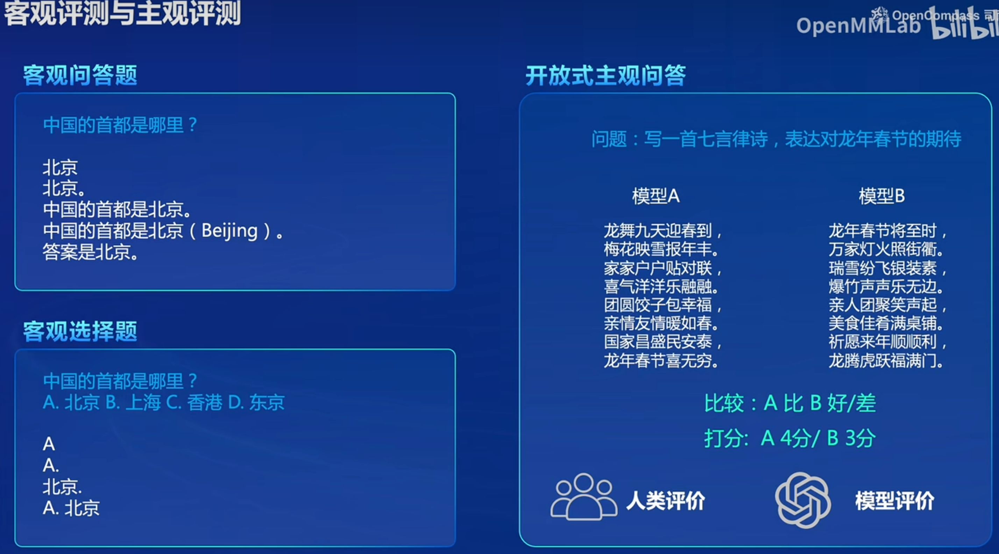    

## OpenCOmpass 大模型评测全栈工具链    

大模型评测全栈工具链 CompassKit：    

- 支持模型推理的后端：LMDeploy VLLM 
- 支持多模态评测工具：VLMEvalkit
- 代码评测工具: Code-Evaluator
- 模型入门工具: MixtralKit MoE

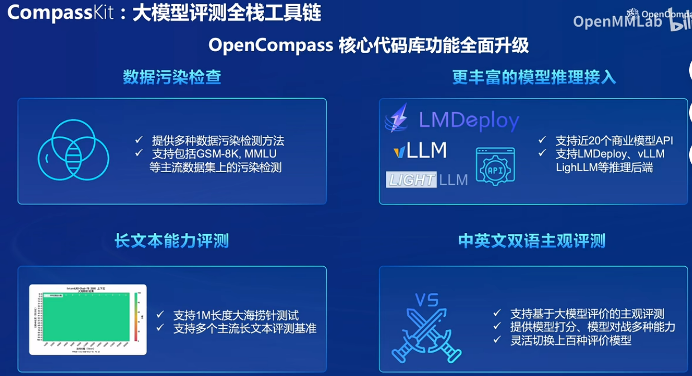   


## OpenCompass 自研高质量大模型评测基准数据集：    

- 数学能力
- LLM反思能力
- LLM基础能力
- 中文创作能力
- 代码解释器能力

 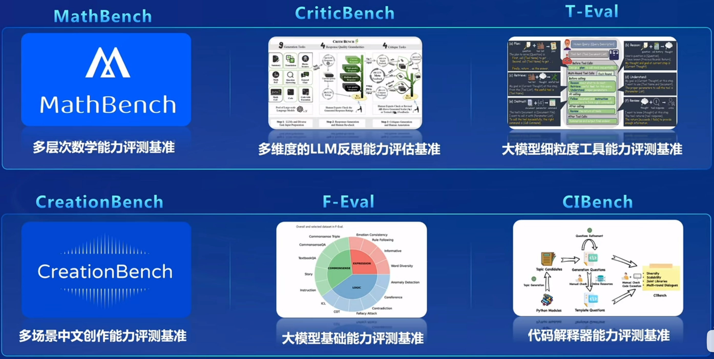   

行业生态：
- 金融测评
- 司法能力基准（南京大学）
- 中文医疗大模型评测基准
- 网络安全评测基准（腾讯）


   
# 实战    

## 1. 环境配置    

### 1.1 创建开发机和conda环境

界面选择镜像为 `Cuda11.7-conda`，并选择 GPU 为`10% A100`。    

### 1.2 面向GPU的conda环境安装    

```
studio-conda -o internlm-base -t opencompass
source activate opencompass
git clone -b 0.2.4 https://github.com/open-compass/opencompass
cd opencompass
pip install -v -e .
```

补充安装：
```
pip install -r requirements.txt
pip install protobuf
```   
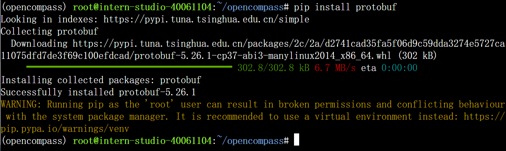  

有部分第三方功能,如代码能力基准测试 Humaneval 以及 Llama格式的模型评测,可能需要额外步骤才能正常运行，如需评测，详细步骤请参考安装指南。    

### 1.3 数据准备    

解压评测数据集到 data/ 处，将会在opencompass下看到data文件夹：        
```
cd /root/opencompass
cp /share/temp/datasets/OpenCompassData-core-20231110.zip /root/opencompass/
unzip OpenCompassData-core-20231110.zip
```

### 1.4 查看支持的数据集和模型    

解压评测数据集到 data/ 处   
```
cd /root/opencompass
cp /share/temp/datasets/OpenCompassData-core-20231110.zip /root/opencompass/
unzip OpenCompassData-core-20231110.zip
rm OpenCompassData-core-20231110.zip
```
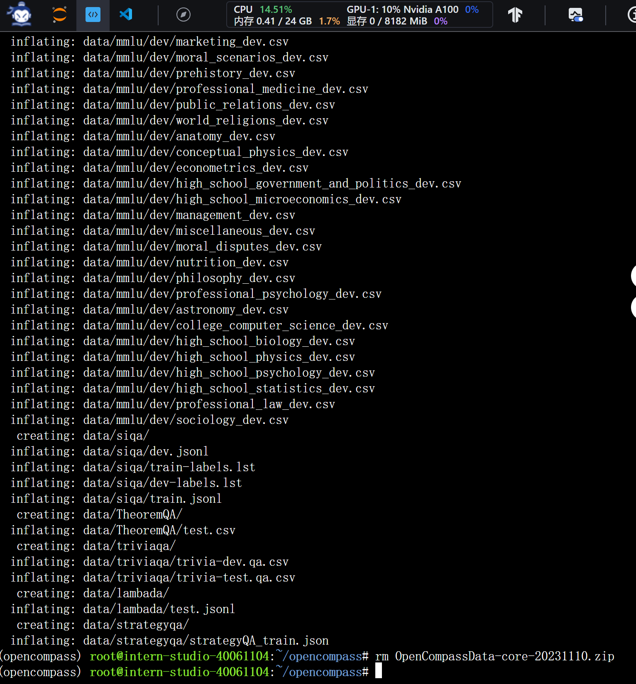     


列出所有跟 internlm 及 ceval 相关的配置    

```
cd /root/opencompass
python tools/list_configs.py internlm ceval
```

将会看到    

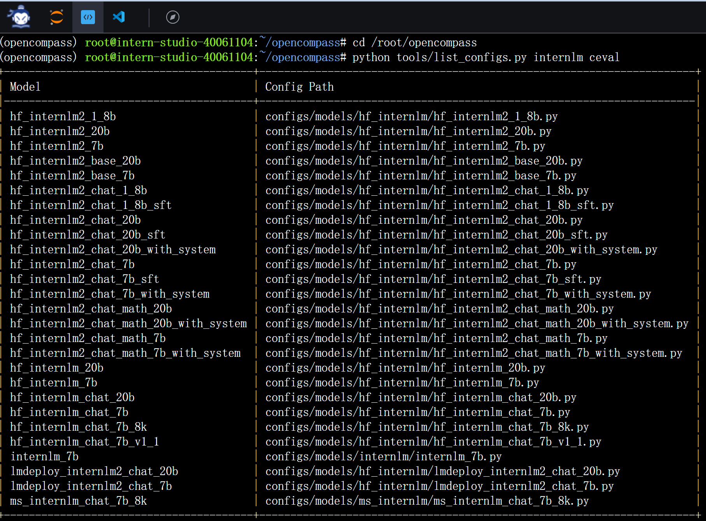   
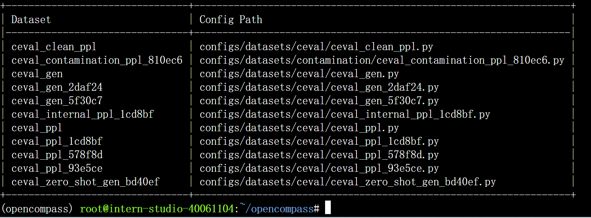   

### 1.5 启动评测 (10% A100 8GB 资源)    

确保按照上述步骤正确安装 OpenCompass 并准备好数据集后，可以通过以下命令评测 InternLM2-Chat-1.8B 模型在 C-Eval 数据集上的性能。由于 OpenCompass 默认并行启动评估过程，我们可以在第一次运行时以 --debug 模式启动评估，并检查是否存在问题。在 --debug 模式下，任务将按顺序执行，并实时打印输出。   

```
cd /root/opencompass

export MKL_SERVICE_FORCE_INTEL=1
#或
export MKL_THREADING_LAYER=GNU

python run.py \
--datasets ceval_gen \
--hf-path /share/new_models/Shanghai_AI_Laboratory/internlm2-chat-1_8b \  # HuggingFace 模型路径
--tokenizer-path /share/new_models/Shanghai_AI_Laboratory/internlm2-chat-1_8b \  # HuggingFace tokenizer 路径（如果与模型路径相同，可以省略）
--tokenizer-kwargs padding_side='left' truncation='left' trust_remote_code=True \  # 构建 tokenizer 的参数
--model-kwargs device_map='auto' trust_remote_code=True \  # 构建模型的参数
--max-seq-len 1024 \  # 模型可以接受的最大序列长度
--max-out-len 16 \  # 生成的最大 token 数
--batch-size 2  \  # 批量大小
--num-gpus 1  \  # 运行模型所需的 GPU 数量

```
运行命令：   

```
python run.py --datasets ceval_gen --hf-path /share/new_models/Shanghai_AI_Laboratory/internlm2-chat-1_8b --tokenizer-path /share/new_models/Shanghai_AI_Laboratory/internlm2-chat-1_8b --tokenizer-kwargs padding_side='left' truncation='left' trust_remote_code=True --model-kwargs trust_remote_code=True device_map='auto' --max-seq-len 1024 --max-out-len 16 --batch-size 2 --num-gpus 1 --debug
```

测评结果：     

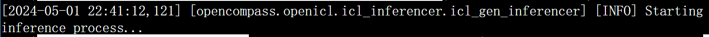
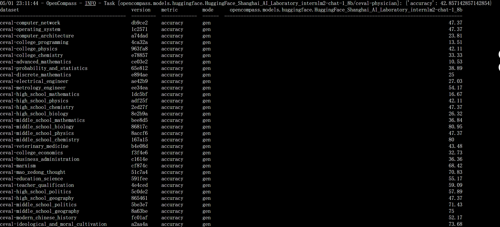
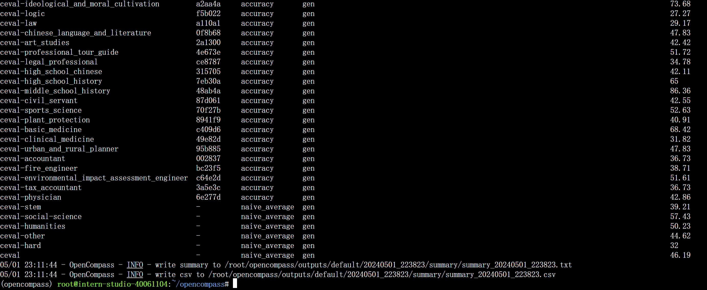

# 第7课 作业   

## 基础作业    

- 使用 OpenCompass 评测 internlm2-chat-1_8b 模型在 C-Eval 数据集上的性能
  - Dennis作业 详见 笔记1.1 - 1.5 评测结果如下:
    


       
